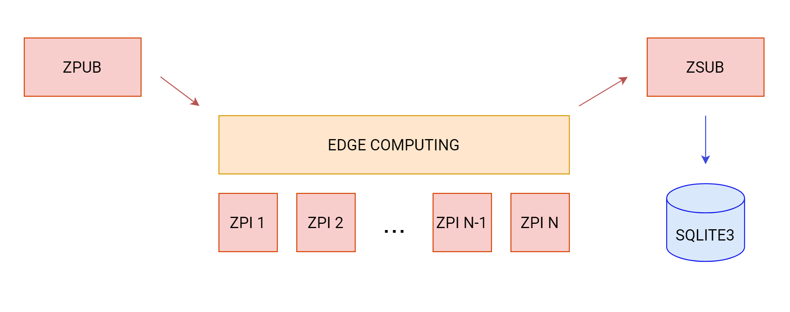

# :page_facing_up: Edge#DA
Project for the Data Analytics course at the University of Camerino.

## Description
The project goal was to understand how a framework like [ZeroMQ](https://zeromq.org) could be used to move data computation from the cloud to the edge, the closest level to where the data is generated. 

ZeroMQ provided to be an interesting choice due to its lightness and simplicity, as the designed system should run on devices with limited resources.

The framework was used in its C implementation, with the following architecture:


- `zpub`, a node which is responsible to send data to the Edge Computing layer;
- `Edge Computing`, a cluster composed by several nodes (running the same executable, `zpi`), which are responsible to filter the information and forward it to `zsub`. It is noticeable how the data arrives to this layer: `zpub` will distribute it evenly using a **Round Robin** scheduling;
- `zsub`, a node which is responsible to store the data received from the `Edge Computing` layer into an [SQlite](https://sqlite) database.

## Prerequisites
- Debian or Ubuntu based Linux distribution*
- make
- gcc

\* tested on Ubuntu 21.04
## Installation
In order to install all the required libraries the command below should be run:

```
sudo apt install libzmq3-dev sqlite3 libsqlite3-dev uuid-dev
```
That includes the installation of **ZeroMQ**, **SQlite** and a library to operate with UUIDs.

In order to compile the solution, `make` should be used, running the command below in the project directory:
```
make all
```
At this point three executables (`zpub`, `zpi`, `zsub`) should have been created inside the new `out` directory.
## Usage

To run the proposed demo, at least three sessions must be used. This can be achieved opening different terminals or using a terminal multiplexer (e.g. [screen](https://www.gnu.org/software/screen/)).

One terminal will run `zpub`:
```
out/zpub [OPTIONS]
```
Following options are available:
```
-q <QUANTITY>        the program will send QUANTITY messages

-f <FREQUENCY>       the program will send message every FREQUENCY ms
```
One or more terminals will run `zpi`.
```
out/zpi
```
One terminal will run `zsub`.
```
out/zsub
```
To check if everything went well it is possible to access the database called `test.db` generated by `zsub` using the following command:
```
sqlite3 test.db
```
Therefore, the query below would count how many data rows were written:
```
select count(*)/3 from data;
```
If the number that comes out as a result is the same of the sent messages the communication went through without any loss.

*Note: the count result in the query is divided by 3 because any message sent by `zpub` is then split into three messages by `zpi`.*

## Authors
- **Luca Cervioni** (115919) \
luca.cervioni@studenti.unicam.it
- **Dmitry Mingazov** (115857) \
dmitry.mingazov@studenti.unicam.it
- **Tommaso Carletti** (115853) \
tommaso.carletti@studenti.unicam.it
